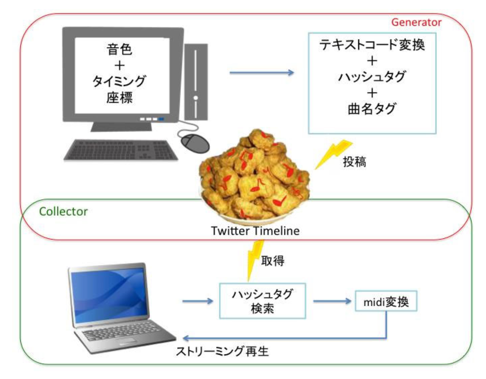
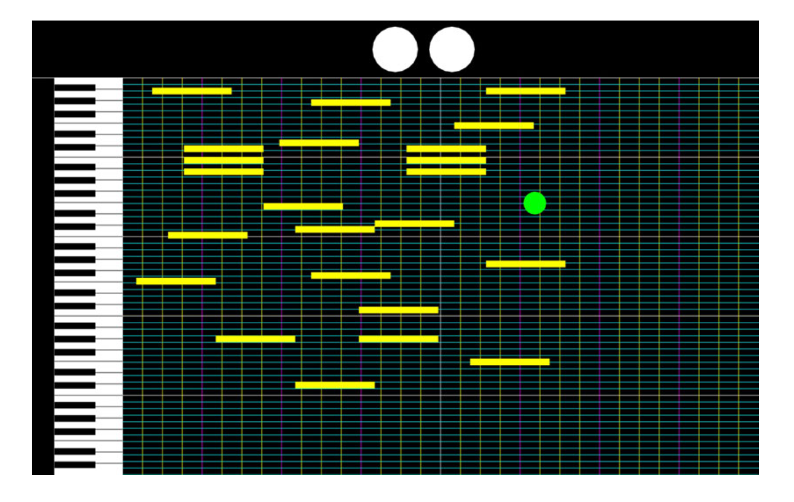
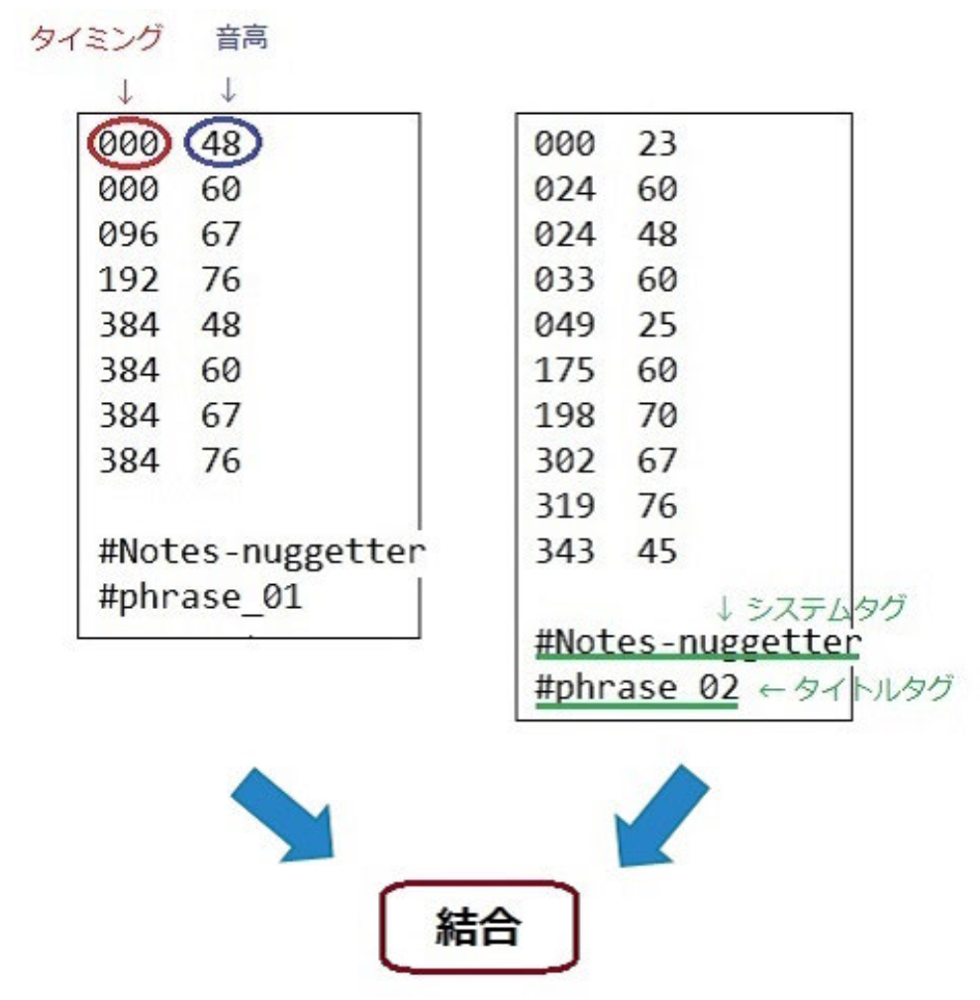

# Notes-nuggetter: Twitterを用いた不可逆的・集合的音楽創作システム

## 概要
Twitter等のSNSによるコミュニケーションおよび手軽な音楽制作ツールの普及を背景として、音楽制作をさらに手軽にかつ直観的な操作で行えるようにするとともに、Twitterを利用してユーザ間で集合的かつ不可逆的に音楽作品を創作できるシステム『Notes-nuggetter』を提案しました。

GUIから創作したフレーズを文字コード化したものをTwitterに投稿し、他のユーザが投稿したフレーズを時系列的・非同期的に鑑賞することができます。

このシステムにより様々なユーザどうしが自由にそれぞれ音楽を結合し合い、新しい音楽が生まれていくことが期待されます。将来的には、ユーザ同士の音楽の時系列的な結合だけでなく、音楽的に調和のとれた状態で同時に再生できる機構をも付加したいと考えております。

<table style="border-style: none;">
  <tr style="border-style: none;">
    <td style="border-style: none;">
      
    </td>
    <td style="border-style: none;">
      
      
    </td>
  </tr>
</table>

## 発表論文
[鳥谷輝樹, 福成毅, 西本一志 "Notes-nuggetter: Twitterを用いた不可逆的・集合的音楽創作システム" 情報処理学会インタラクション2015](http://www.interaction-ipsj.org/proceedings/2015/data/20150226/B09.pdf)

